PROJECT NAME: SELSEY HOUSE – OFFICIAL WEBSITE

This is the second Milestone Project undertaken as part of the course for the Full stack developer certification from Code Institute. The requirement is to build an interactive front-end site that would respond to the users' actions, allowing them to actively engage with data and alter the way the site displays the information to achieve their preferred goals. 

UX – 

London being one of the largest cities in Europe, attracts a vast number of travellers every year for business and sightseeing. Selsey House is a luxury bed and breakfast that is based in Kensington, central London. The purpose of the website is to showcase all the features and services of Selsey House that would appeal to potential customers. 

This is an extremely competitive business where users have hundreds of options to choose from. Hence, it is extremely important to grab the user’s interest within a few seconds before they lose interest. I have relied more on visual imagery and less text content to get the user’s attention. 

The principle purpose of the website is to solicit bookings from business and casual travellers who are looking for accommodation in Kensington, central London. The intention is to interact with customers, providing all the information they would potentially need to decide and make a booking.

WIREFRAMES - 

1.	Mobile Wireframe (Github link) - https://github.com/RoVsEk23/SGH_M2/blob/master/assets/wireframes/Mobile%20Wireframe%20MP2.pdf
2.	Desktop wireframe (Github link) - https://github.com/RoVsEk23/SGH_M2/blob/master/assets/wireframes/Desktop%20Wireframe%20MP2.pdf

TECHNOLOGY -

CSS, HTML, Bootstrap,JavaScript, jQuery, LightBox, GoogleMaps API, Exchange Rates API, EmailJS, Font Awesome.

LAYOUT - 

The site consists of the following pages
1.	Home
2.	Rooms
3.	Services
4.	Contact Us 

HEADER AND FOOTER – 

The desktop version of the website has a header and footer that is common to every page. The header has a logo with the menu, a check availability button and social media icons.

 

On the mobile version, the header has just the logo and a dropdown menu from the burger icon.

The desktop and mobile version of the footer have the same components. a box with content related to the interactive map and a check availability form. This is followed by the logo, address and social media icons.
   

PAGE 1 - HOME

The homepage consists of 9 images that display many parts of the house, namely living and dining rooms as well as a view of the streets outside. We have some text on few of the images. 

     

PAGE 2 - ROOMS

The rooms page displays images of the 4 different bedrooms available and 2 bathrooms. The images display text related to names and pricing.

    

PAGE 3 - SERVICES

The services page is a compilation of content that covers the services provided.

    

PAGE 4 - CONTACT US

The contact us page has a general enquiry form, a text box with address and directions and a currency calculator.

  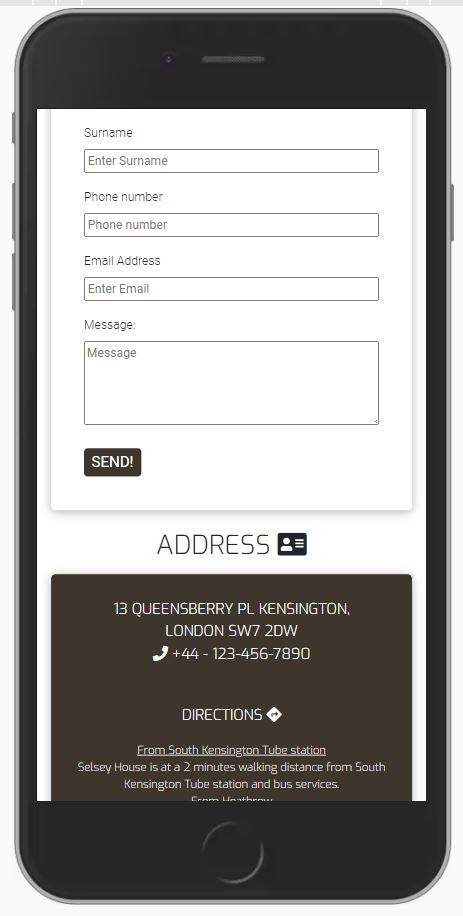 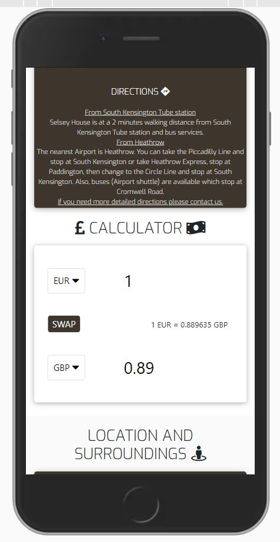 

INTERACTIVE FEATURES - 

1. FORMS

We have two types of forms on the site; a check availability form on the footer of every page and a general enquiry form on the contact page. There is a check availability button on the header of every page that links down to the check availability form on the footer. 

Our intention is to provide the user with as much of a chance to fill out the check availabilty form without having to navigate towards it. (Keeping the visibility as high as possible.)

 

The general enquiry form on the contact page is to increase interactivity with the user so they can send a message, or provide a feedback or a suggestion. 

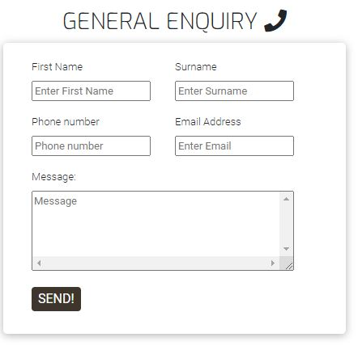 

2. MAP

We have an interactive map on the footer of every page with some text that explains to the user how to use the map. Our intention is to display the central location of the property and the various amenities and attractions.

    

3. GALLERY 

I think that visual imagery is the main deciding factor that influences decision making and leads to a booking. We have a gallery feature on the home and rooms page that allows the user to expand and browse all the images.

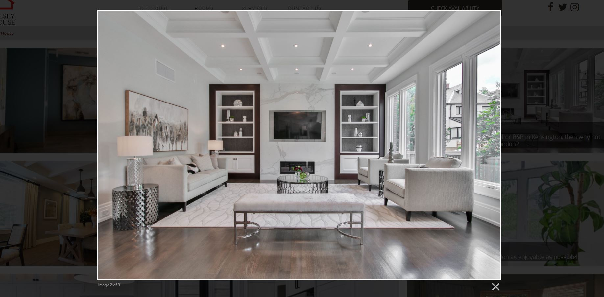 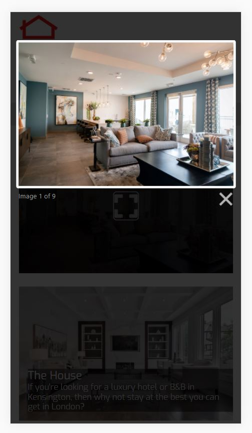   

4. CURRENCY CALCULATOR

As we expect most of the users to be international travellers, we think its important to add a currency convertor feature so the user can convery the prices displayed, budget etc.

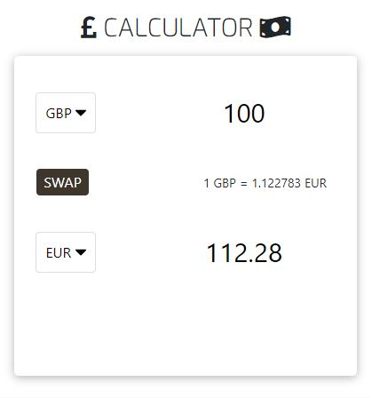 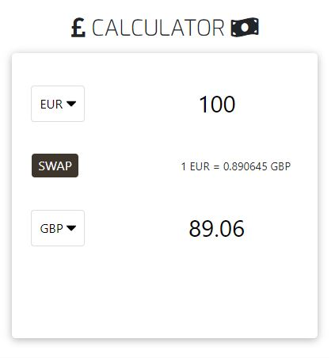   

USER STORIES - 

A. As a business traveller I am looking for a bed and breakfast with good travel links into central London for my client visits.

ACCEPTANCE CRITERIA - 

1. A wholly interactive map on the footer of every page allows the user to check distances to various train stations.
2. Services listed service page cater to business travellers.
3. Ability to contact the management through the general enquiry form to check for any additional requests.
4. Ability to check availability online.

B. As an international traveller on holiday, I am looking for a bed and breakfast within budget in London with good amenities and attractions.

ACCEPTANCE CRITERIA - 

1. The interactive map allows the user to check ease of access to various amenities, tourist attractions and the central location of the property.
2. The currency converter on the contacts page can be used to check budgets against the prices listed for various rooms.
3. Ability to check availability online.

C. As a frequent traveller, I am looking for a luxurious bed and breakfast which provides lots of additional services.

ACCEPTANCE CRITERIA - 

1. The home and rooms pages display the pictures as a gallery so the user can have a clearer view of the various rooms and features.
2. Detailed list of services provided on the services page.
3. Ability to contact the management through the general enquiry form to check for any additional requests.
4. Ability to check availability online.

TESTING 

W3C Markup Validator and W3C CSS Validator Services were used to validate every page and check for syntax errors.

BROWSER - 

The site was tested on Google Chrome, Firefox and Microsoft Edge.

RESPONSIVE - 

The website was viewed on a variety of devices such ranging from desktop, tablet, small, medium and large screen mobile devices.

HEADER - 

Check availability button links to check availability form on the footer for all pages.
All social media buttons link to pages on a new tab.

FOOTER -

All info windows on the map display text related to the destination.
All social media buttons link to pages on a new tab.
Check availability form validated.

 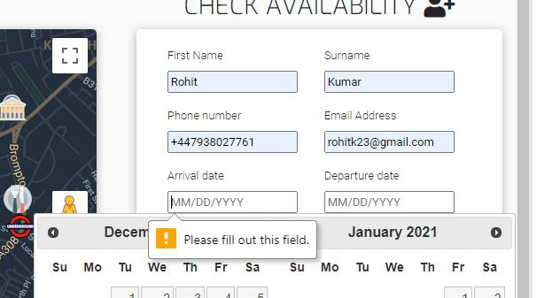 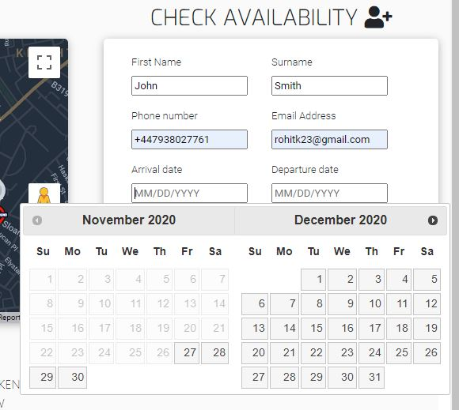 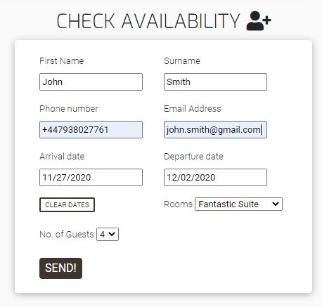 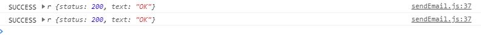 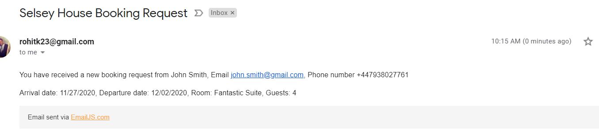

Known bugs - Phone field accepts character apart from just numbers.

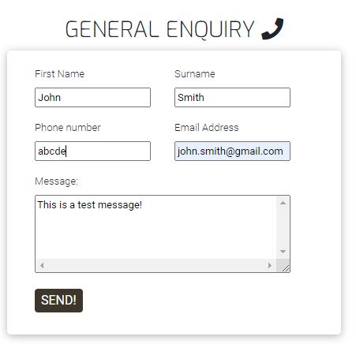 

HOME and ROOMS - 

Gallery view works on both pages.

    

CONTACT - 

General enquiry form validated.

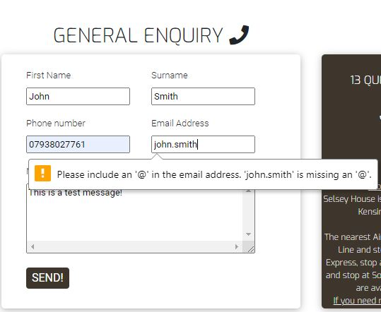 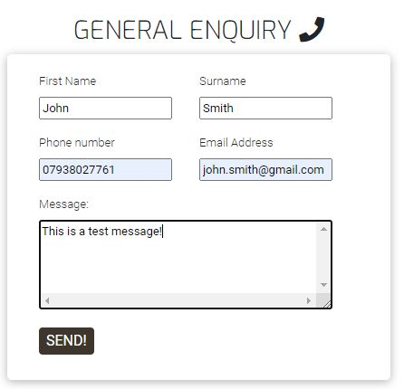 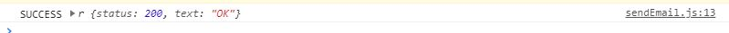 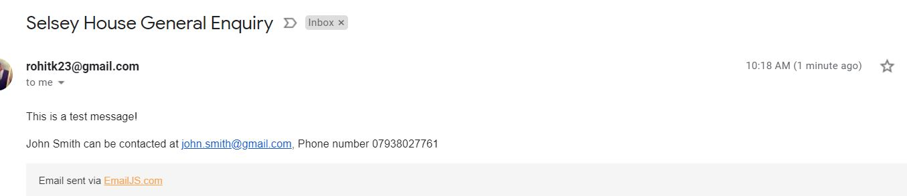

Currency calculator tested.

    

DEPLOYMENT –

The project was deployed to GitHub pages by the following steps

Login to GitHub and select the project repository.

Click on settings on the project menu.

Locate the GitHub pages section.

Under source, select master branch from the dropdown menu keeping folder as root and then save.

The GitHub page source is then saved.

Refresh the page and the site link is displayed under GitHub pages.

https://rovsek23.github.io/SGH_M2/

