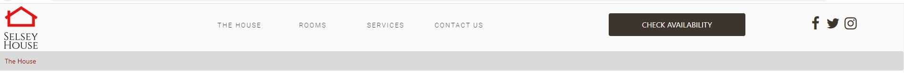
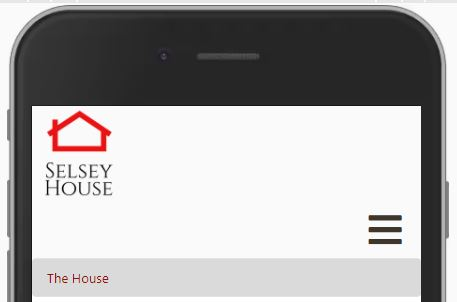
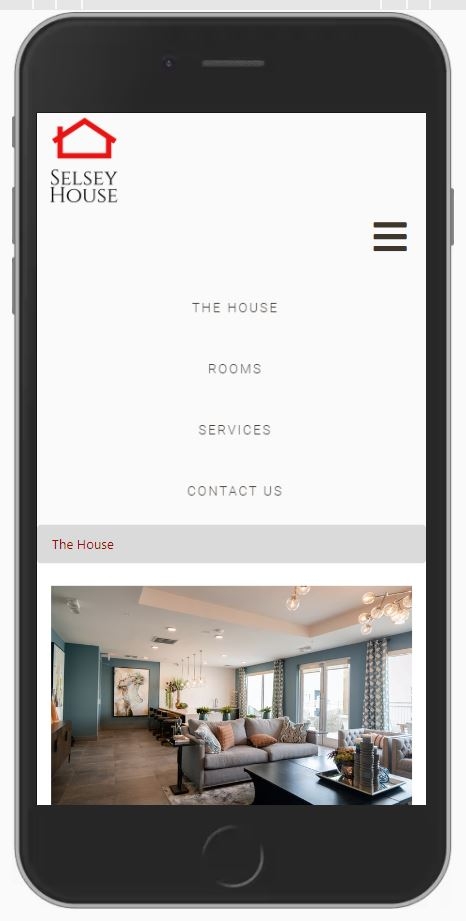
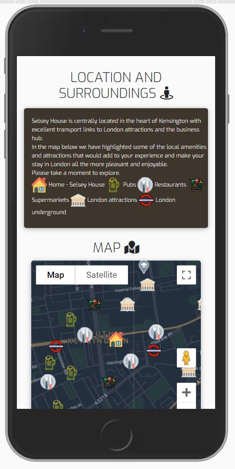
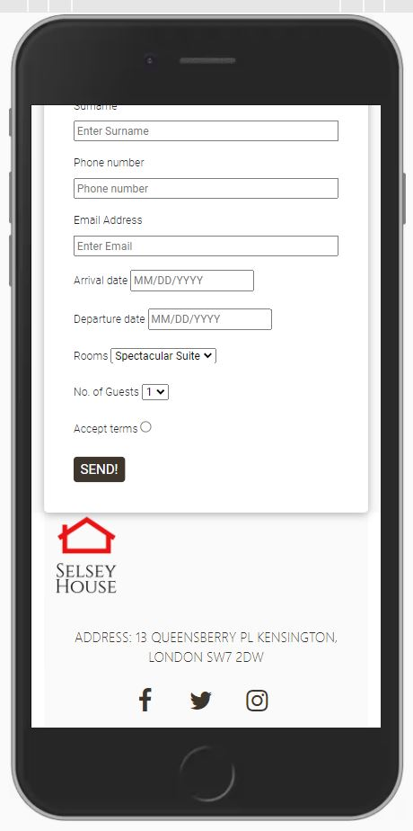
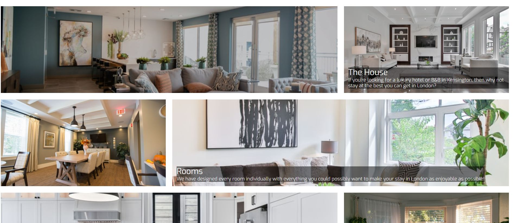
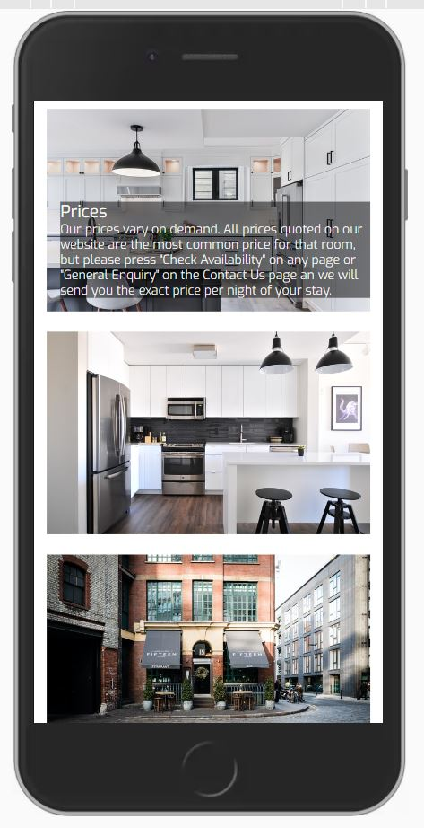
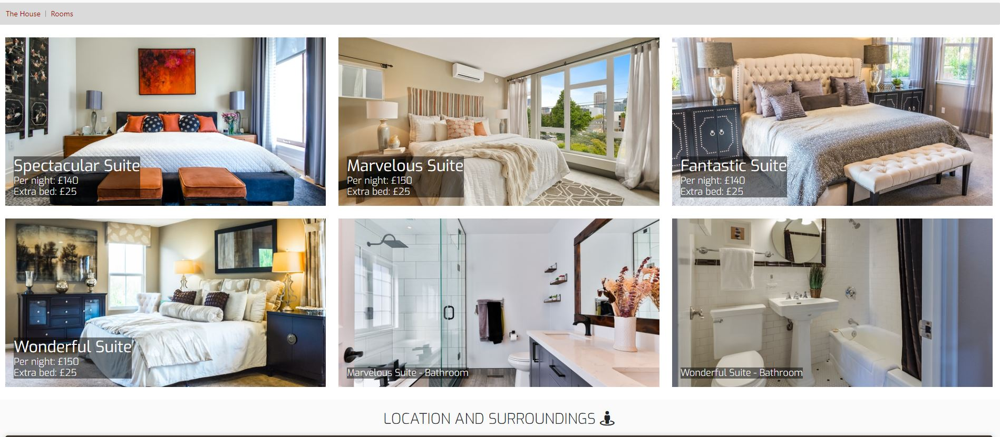
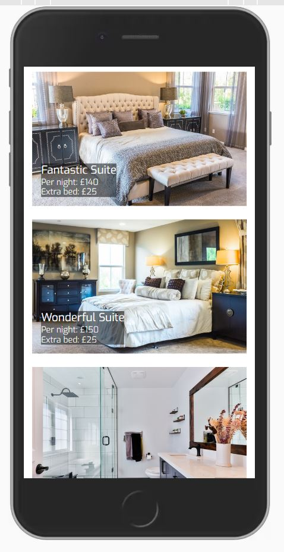
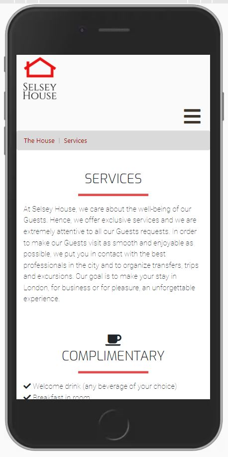

Project Name: Selsey House – Official Website

This is the second Milestone Project undertaken as part of the course for the Full stack developer certification from Code Institute. The requirement is to build an interactive front-end site that would respond to the users' actions, allowing them to actively engage with data and alter the way the site displays the information to achieve their preferred goals. 

UX – 

London being one of the largest cities in Europe, attracts a vast number of travellers every year for business and sightseeing. Selsey House is a luxury bed and breakfast that is based in Kensington, central London. The purpose of the website is to showcase all the features and services of Selsey House that would appeal to potential customers. 

This is an extremely competitive business where users have hundreds of options to choose from. Hence, it is extremely important to grab the user’s interest within a few seconds before they lose interest. I have relied more on visual imagery and less text content to get the user’s attention. 

The principle purpose of the website is to solicit bookings from business and casual travellers who are looking for accommodation in Kensington, central London. The intention is to interact with customers, providing all the information they would potentially need to decide and make a booking.

Wireframes - 
1.	Mobile Wireframe (Github link) - https://github.com/RoVsEk23/SGH_M2/blob/master/assets/wireframes/Mobile%20Wireframe%20MP2.pdf
2.	Desktop wireframe (Github link) - https://github.com/RoVsEk23/SGH_M2/blob/master/assets/wireframes/Desktop%20Wireframe%20MP2.pdf

Layout - 
The site consists of the following pages
1.	Home
2.	Rooms
3.	Services
4.	Contact Us 

Header and Footer – 

The desktop version of the website has a header and footer that is common to every page. The header has a logo with the menu, a check availability button and social media icons.

 

On the mobile version, the header has just the logo and a dropdown menu from the burger icon.

The desktop and mobile version of the footer have the same components. a box with content related to the interactive map and a check availability form. This is followed by the logo, address and social media icons.
   

HOME

The homepage consists of 9 images that display many parts of the house, namely living and dining rooms as well as a view of the streets outside. We have some text on few of the images. 

     

ROOMS

The rooms page displays images of the 4 different bedrooms available and 2 bathrooms. The images display text related to names and pricing.

    

SERVICES

The services page is a compilation of content that covers the services provided.

    

CONTACT US

The contact us page 
